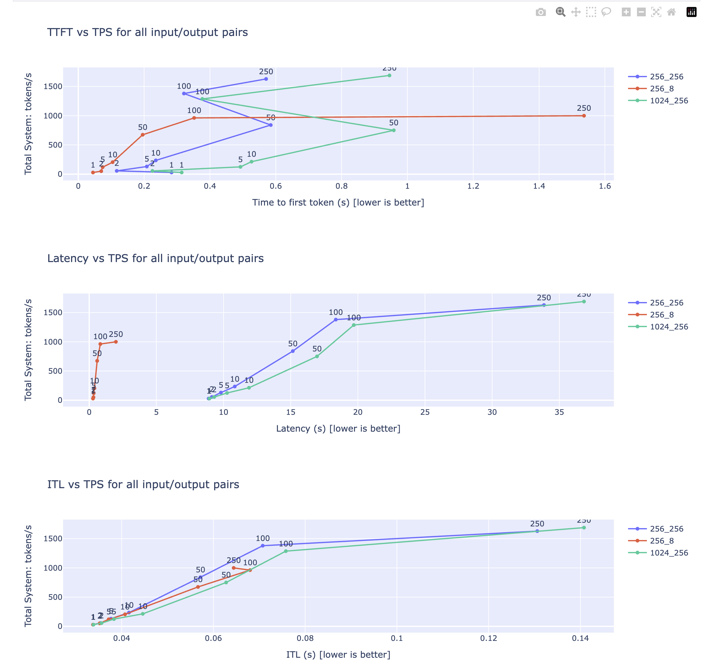

# Nvidia GenAI-Perf Benchmark Suite

## Deploy Benchmark Runner

First create the namespace:

```bash
kubectl create ns vllm-benchmark
```

Now create the configmap with [run_vllm_upstream_benchmark.sh](run_vllm_upstream_benchmark.sh) and other values in it:

```bash
kubectl -n vllm-benchmark create configmap benchmark-runner \
    --from-literal=TEST_SERVER_URL="http://llama-3-3-70b-instruct.default:8000" \
    --from-literal=MODEL_NAME="meta-llama/Llama-3.3-70B-Instruct"
```

Let's create a Kubernetes secret with hugging token. First get the token by going [here](https://huggingface.co/settings/tokens). You only need a "Read" token. Copy and export the token as an environment variable:

```bash
export HF_TOKEN=""
```

Now create a secret in Kubernetes:

```bash
kubectl -n vllm-benchmark create secret generic hf-token-secret --from-literal token=${HF_TOKEN}
```

Deploy the benchmark runner:

```bash
kubectl apply -f benchmark/vllm_upstream/k8s/
```

See if the pods are running by running the following command:

```bash
kubectl -n vllm-benchmark \
    get pods \
    -l app=benchmark-runner
```

## Run Benchmarks

Find the VLLM benchmark pod:

```bash
POD_NAME=$(kubectl -n vllm-benchmark \
    get pods \
    -l app=benchmark-runner \
    --field-selector=status.phase=Running \
    -o jsonpath='{.items[].metadata.name}')
```

Run the benchmark tests:

```bash
kubectl -n vllm-benchmark \
    exec -it $POD_NAME \
    -- bash
```

Once inside the pod, run the benchmark command:

```bash
/root/scripts/genai-perf-runner.sh
```

Since the above script also generates the plots, you can find those images in the `plots` folder of each benchmark run like this:

```bash
# ls genai-perf-results/artifacts/meta-llama_Llama-3.3-70B-Instruct-openai-chat-concurrency250/plots/
config.yaml                                                             time_to_first_token.html
distribution_of_input_sequence_lengths_to_output_sequence_lengths.gzip  time_to_first_token.jpeg
distribution_of_input_sequence_lengths_to_output_sequence_lengths.html  time_to_first_token_vs_input_sequence_lengths.gzip
distribution_of_input_sequence_lengths_to_output_sequence_lengths.jpeg  time_to_first_token_vs_input_sequence_lengths.html
request_latency.gzip                                                    time_to_first_token_vs_input_sequence_lengths.jpeg
request_latency.html                                                    token-to-token_latency_vs_output_token_position.gzip
request_latency.jpeg                                                    token-to-token_latency_vs_output_token_position.html
time_to_first_token.gzip                                                token-to-token_latency_vs_output_token_position.jpeg
```

## Jupyter Notebook

Port forward the Jupyter Notebook pod:

```bash
kubectl -n vllm-benchmark port-forward pod/${POD_NAME} 8888
```

Now you can access the Jupyter Notebook at [http://localhost:8888](http://localhost:8888).

Once inside the Jupyter Notebook, navigate to the `scripts` folder and open `genai-perf-plot.ipynb` and run the cells to visualize the benchmark results.

You can see the results like these:


